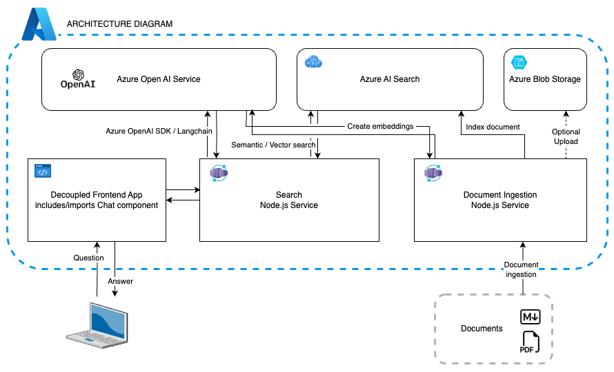
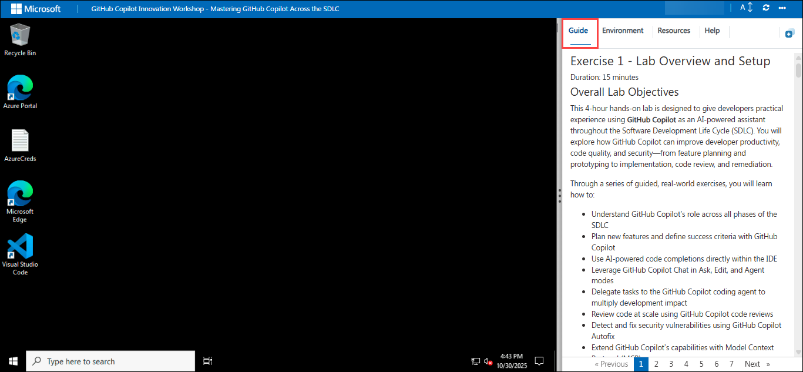
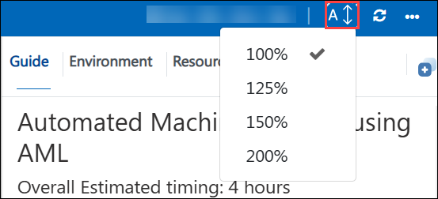
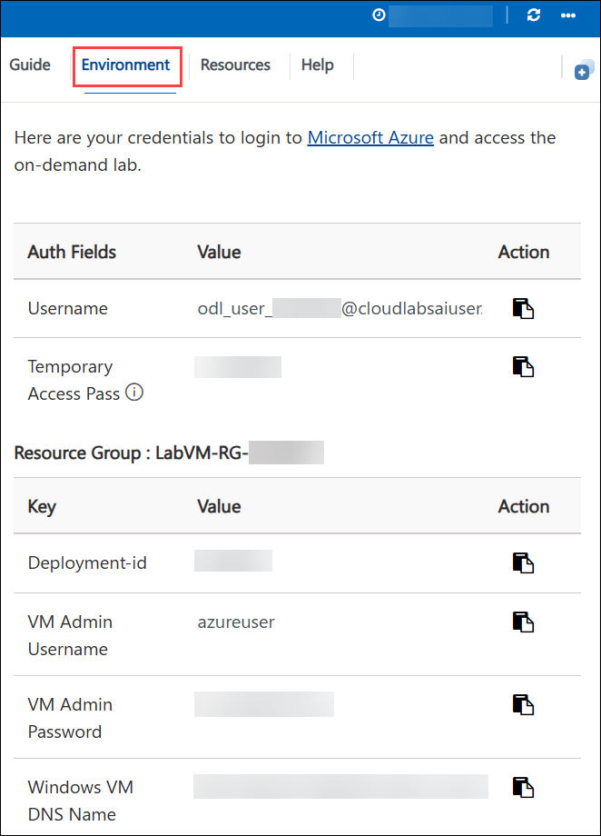
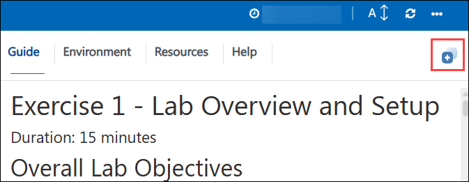
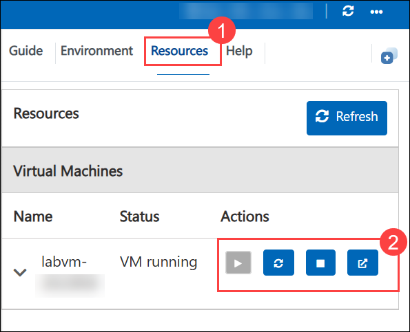
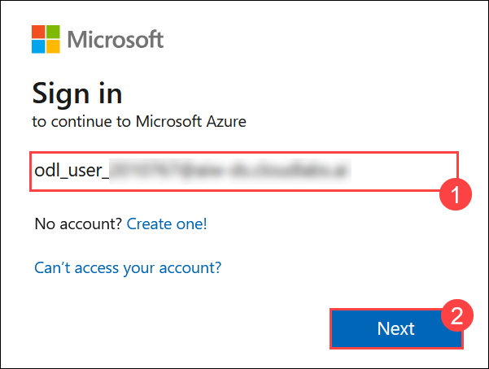
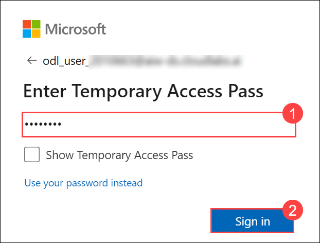
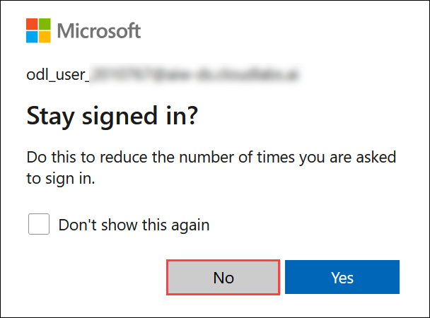

# ChatGPT + Enterprise data with Azure OpenAI and Azure AI Search
### Overall Estimated Duration: 4 Hours

---
## Overview
In this hands-on lab, you will build a production-style Retrieval-Augmented Generation (RAG) application from the ground up on Microsoft Azure. You will work with the Contoso Real Estate sample scenario — a fictitious company whose customers can ask intelligent, document-grounded questions through a ChatGPT-style chat interface powered by Azure OpenAI and Azure AI Search.

The lab takes you through the complete data and deployment lifecycle: uploading source documents to Azure Blob Storage, creating and deploying Azure OpenAI model deployments, configuring Azure AI Search with a full import pipeline (data source, skillset, index, and indexer), and finally launching the Search API Container App and the Static Web App frontend so that the end-to-end RAG experience is live and testable.

All core infrastructure has been pre-provisioned using a Bicep template deployed into your Azure resource group. Your task is to configure, populate, and validate the AI services that bring the application to life.

## Architecture Overview

This exercise sets up the foundational environment for your Azure OpenAI and Azure AI Search RAG application. The architecture diagram below shows the complete system and data flow you'll be working with throughout the workshop:

This diagram shows the following flow:

- A user submits a question through the decoupled frontend chat application.
- The frontend sends the query to the Search Node.js service, which orchestrates the RAG workflow.
- The Search Node.js service uses the Azure OpenAI SDK / LangChain to invoke Azure OpenAI for prompt completion.
- For document retrieval, the Search service queries Azure AI Search using semantic/vector search.
- The Document Ingestion Node.js service ingests raw documents (PDF, Markdown, etc.) and sends them to Azure Blob Storage as the knowledge base.
- The ingestion service also indexes documents in Azure AI Search and creates embeddings through Azure OpenAI.
- Azure AI Search stores the semantic index and returns the most relevant document chunks to the Search service.
- The Search service combines retrieved context with the user query and forwards it to Azure OpenAI to generate the final answer.

**Key components in the diagram:**
- **Decoupled Frontend App**: Hosts the chat UI and sends user questions to the backend.
- **Search Node.js Service**: Orchestrates search, retrieval, and OpenAI completions.
- **Document Ingestion Node.js Service**: Handles document upload, storage, indexing, and embedding creation.
- **Azure OpenAI Service**: Provides GPT-based chat completions and embeddings.
- **Azure AI Search**: Performs semantic search and stores indexed document vectors.
- **Azure Blob Storage**: Stores source documents used by the ingestion pipeline.

---
## Objectives
By the end of this lab, you will be able to:

- Explore pre-deployed Azure infrastructure provisioned via Bicep, including Container Apps, Azure AI Search, Azure OpenAI, Azure Blob Storage, and a Static Web App.
- Upload and manage documents in Azure Blob Storage to serve as the knowledge base for your RAG application.
- Deploy Azure OpenAI model deployments — a GPT-4o chat model and a text-embedding-ada-002 embedding model — through Azure AI Foundry.
- Configure the Azure AI Search pipeline using the Import Data wizard to create a data source, skillset, index, and indexer pointing at your Blob Storage.
- Validate the end-to-end RAG experience by interacting with the live Static Web App frontend and posing document-grounded questions.

# Getting Started with Lab
 
Welcome to your Automated Machine learning using AML workshop! We've prepared a seamless environment for you to explore and learn about machine learning and AI concepts and related Microsoft Azure services. Let's begin by making the most of this experience:
 
## Accessing Your Lab Environment
 
Once you're ready to dive in, your virtual machine and **Guide** will be right at your fingertips within your web browser.
 

## Lab Guide Zoom In/Zoom Out
 
To adjust the zoom level for the environment page, click the **A↕** icon located next to the timer in the lab environment.

   

### Virtual Machine & Lab Guide
 
Your virtual machine is your workhorse throughout the workshop. The lab guide is your roadmap to success.

## Exploring Your Lab Resources
 
To get a better understanding of your lab resources and credentials, navigate to the **Environment** tab.
 

## Utilizing the Split Window Feature
 
For convenience, you can open the lab guide in a separate window by selecting the **Split Window** button from the Top right corner.
 

## Managing Your Virtual Machine
 
Feel free to **Start, Stop, or Restart (2)** your virtual machine as needed from the **Resources (1)** tab. Your experience is in your hands!
 

## Let's Get Started with Azure Portal
 
1. On your virtual machine, click on the Azure Portal icon as shown below:
 
   

2. You'll see the **Sign into Microsoft Azure** tab. Here, enter your credentials and click **Next (2)**
 
   - **Email/Username:** <inject key="AzureAdUserEmail"></inject>**(1)**
 
      
 
3. Next, provide your Temporary Password and click on **Sign in (2)**
 
   - **Temporary Access Pass:** <inject key="AzureAdUserPassword"></inject>**(1)**
 
     
 
4. If prompted to stay signed in, you can click **No**.

   
 

## Support Contact
 
The CloudLabs support team is available 24/7, 365 days a year, via email and live chat to ensure seamless assistance at any time. We offer dedicated support channels explicitly tailored for both learners and instructors, ensuring that all your needs are promptly and efficiently addressed.
 
Learner Support Contacts:
 
- Email Support: cloudlabs-support@spektrasystems.com
- Live Chat Support: https://cloudlabs.ai/labs-support

Click on **Next** from the lower right corner to move on to the next page.

   .png)

## Happy Learning !!