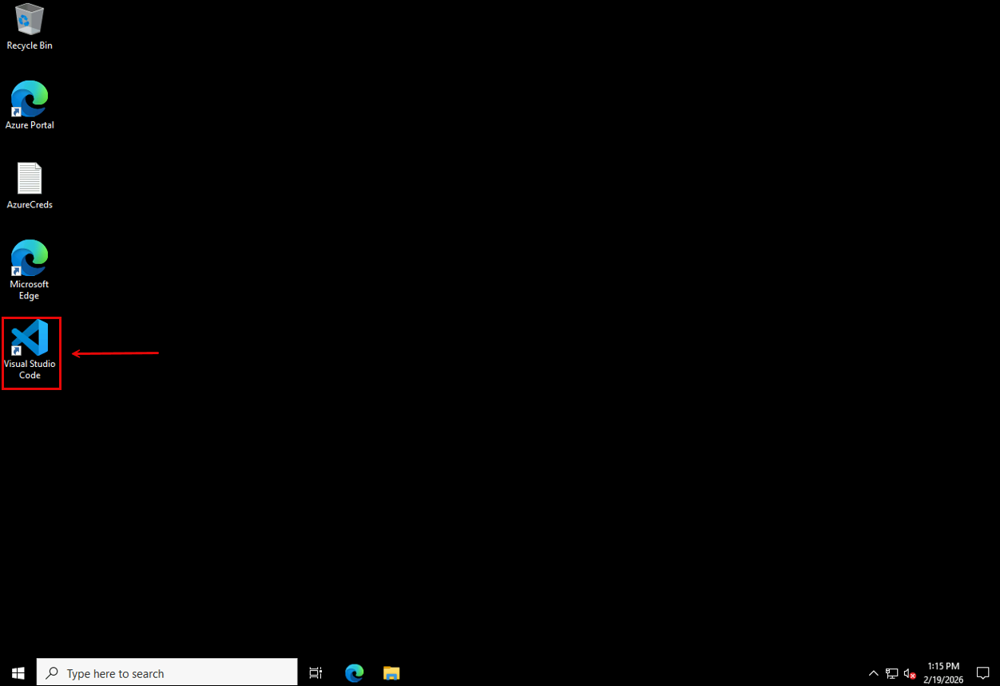
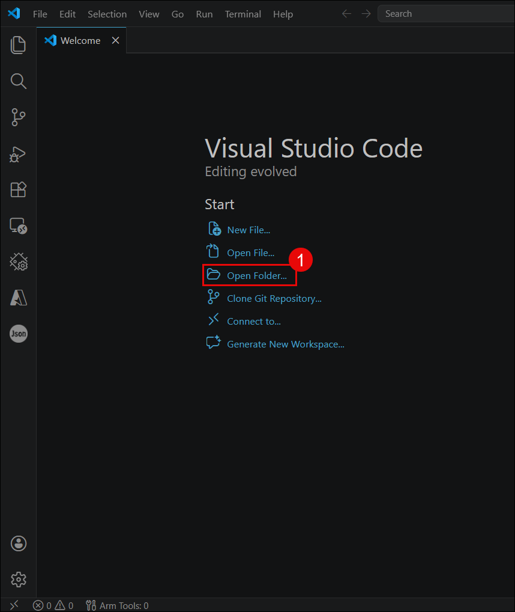
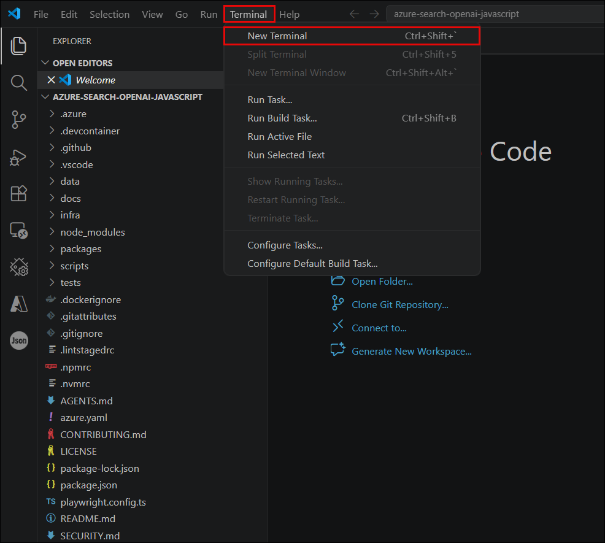
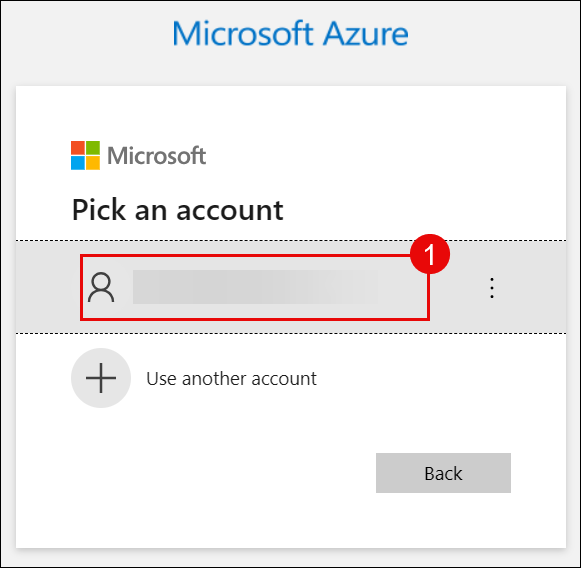
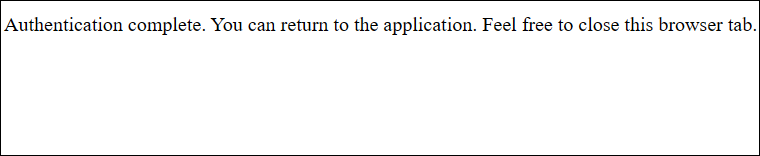

# Exercise 1: Environment Setup and Application Deployment

## Architecture Overview

This exercise sets up the foundational environment for your Azure OpenAI and Azure AI Search RAG application. The architecture diagram below shows the complete system and data flow you'll be working with throughout the workshop:


This diagram shows the following flow:

- A user submits a question through the decoupled frontend chat application.
- The frontend sends the query to the Search Node.js service, which orchestrates the RAG workflow.
- The Search Node.js service uses the Azure OpenAI SDK / LangChain to invoke Azure OpenAI for prompt completion.
- For document retrieval, the Search service queries Azure AI Search using semantic/vector search.
- The Document Ingestion Node.js service ingests raw documents (PDF, Markdown, etc.) and sends them to Azure Blob Storage as the knowledge base.
- The ingestion service also indexes documents in Azure AI Search and creates embeddings through Azure OpenAI.
- Azure AI Search stores the semantic index and returns the most relevant document chunks to the Search service.
- The Search service combines retrieved context with the user query and forwards it to Azure OpenAI to generate the final answer.

**Key components in the diagram:**
- **Decoupled Frontend App**: Hosts the chat UI and sends user questions to the backend.
- **Search Node.js Service**: Orchestrates search, retrieval, and OpenAI completions.
- **Document Ingestion Node.js Service**: Handles document upload, storage, indexing, and embedding creation.
- **Azure OpenAI Service**: Provides GPT-based chat completions and embeddings.
- **Azure AI Search**: Performs semantic search and stores indexed document vectors.
- **Azure Blob Storage**: Stores source documents used by the ingestion pipeline.

## Lab scenario

This exercise ensures your workshop environment is ready to begin the Azure OpenAI and Azure AI Search experience. You will launch Visual Studio Code, open the lab repository, authenticate with Azure, and deploy the application code to pre-provisioned Azure resources through the terminal.

## Lab objectives

In this exercise, you will complete the following tasks:

- Task 1: Launch Visual Studio Code and set up the development environment
- Task 2: Authenticate with Azure
- Task 3: Deploy application code to pre-provisioned resources

## Estimated time: 1hr 15 minutes

## Task 1: Launch Visual Studio Code and Set Up Environment

### Launch Visual Studio Code

1. From the lab desktop, click the Visual Studio Code icon to open the editor.

   

2. The VS Code Welcome page appears once the application starts. Click on **Open Folder(1)**.

   

3. Search for **`azure-search-openai-javascript (1)`** folder and click **Select folder (2)**.

   .PNG)

4. Open a **new terminal** from the VS Code **Terminal** menu.

   

   > Use the terminal at the bottom of VS Code to run commands.

### Navigate to Repository

Change into the lab repository directory:

**Run:**

```powershell
cd azure-search-openai-javascript
```

.PNG)

### Install Required Tools and Prerequisites

Run the following commands to install and verify each required tool. If prompted, accept all license agreements and allow changes to your device.

#### Azure Developer CLI (azd)

```powershell
winget install microsoft.azd
azd version
```

.PNG)

#### Node.js LTS

```powershell
winget install OpenJS.NodeJS.LTS
node -v
npm -v
```

.PNG)

#### Git

```powershell
winget install Git.Git
git --version
```

.PNG)

#### PowerShell

```powershell
winget install Microsoft.PowerShell
pwsh --version
```

.PNG)

## Task 2: Authenticate with Azure

1. In the terminal, authenticate to Azure using the Azure Developer CLI:

   ```powershell
   azd auth login
   ```

2. The browser opens and prompts you to **sign in(1)** to Azure.

   

3. After a successful login, the browser confirms that authentication is complete.

   

**Run:**

```
az account show
```

4. And copy the **subscription id (1)**

   .PNG)

```
az group list --output table
```

5. And copy the **resource group (1)**

   .PNG)

Then navigate to **setup-env.ps1(1)** and add the values you copied **here(2)**

.PNG)

.PNG)

Then run:

```
.\setup-env.ps1
```

.PNG)

## Task 3: Deploy Application Code

1. After the environment is set up you can then run:

```powershell
azd deploy
```

.PNG)

Wait for up to 5-10 minutes for the deployment process to complete.

> **azd deploy** in this exercise deploys the backend logic and frontend code to the pre-provisioned Azure Container Apps and Static Web App, ensuring all deployed components are connected and operational.

.PNG)

While the deployment is in progress, you can navigate to the Azure portal and explore all the pre-provisioned resources created for this lab. This will help you understand the Azure services that power your application.

### Navigate to Azure Portal and View Resources

1. Navigate to the [Azure portal](https://portal.azure.com).

   

2. In the Azure portal, search for **Resource groups(1)** in the search bar at the top.

3. Click on **Resource groups(2)** from the search results.

4. Locate and click on your **lab's resource group(3)**.

5. Once inside the resource group, you'll see an overview of all the Azure resources that have been pre-provisioned for this lab.

   .PNG)

   .PNG)

6. Take a moment to explore the different resources. You can click on individual resources to view their configurations and settings.

   .PNG)

> **Note**: Familiarizing yourself with these resources will be helpful as you work through subsequent exercises where you'll interact with Azure OpenAI, Azure AI Search, and other services.

### Resources Created

The following Azure resources have been pre-provisioned for this lab:

| Resource | Description |
|----------|-------------|
| Application Insights | Monitors application performance, detects anomalies, and provides insights for troubleshooting and optimization. |
| Container Apps Environment | Provides the underlying infrastructure for running containerized applications with automatic scaling and management. |
| Azure OpenAI | Hosts OpenAI models for natural language processing, text generation, and AI-powered features in the application. |
| Container Registry | Stores Docker container images used for deploying the backend services. |
| Shared Dashboard | Provides a centralized view of resource metrics and health status across the Azure environment. |
| Smart Detector Alert Rule | Automatically detects and alerts on potential issues in application performance and resource usage. |
| Search Service | Powers the search functionality, enabling efficient querying and indexing of data within the application. |
| Managed Identity | Provides secure authentication for Azure resources without storing credentials in code. |
| Log Analytics Workspace | Collects and analyzes logs from all Azure resources for monitoring and troubleshooting. |
| Container App | Runs the backend application logic in a serverless container environment. |
| Storage Account | Provides scalable cloud storage for application data, blobs, and static content. |
| Static Web App | Hosts the frontend user interface with global distribution and automatic scaling. |

## Summary

In this exercise, you have accomplished the following:

- Set up the development environment with Visual Studio Code and required tools
- Authenticated with Azure and configured the environment
- Deployed application code to pre-provisioned Azure resources
- Reviewed the Azure resources created for the lab environment

You have successfully completed Exercise 1 and are ready to proceed with the next exercises.


