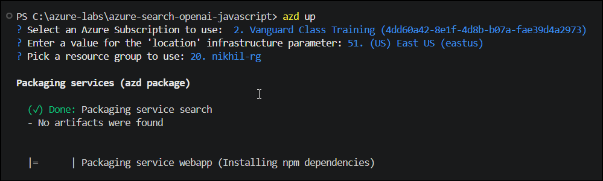

# Lab 1: Environment Setup and Validation

### Overall Estimated Duration: 1hr 15minutes

---

## Overview

This lab ensures your workshop environment is ready to begin the Azure OpenAI and Azure AI Search experience. You will launch Visual Studio Code, open the lab repository, authenticate with Azure, and deploy the resources in azure through the terminal.

---

## Objectives

By the end of this lab, you will be able to:

- Launch Visual Studio Code and open the lab repository folder.
- Open the integrated terminal and authenticate with Azure using `azd`.
- Verify the lab environment is ready for the next module.

---

## 1. Launch Visual Studio Code

1. From the lab desktop, click the Visual Studio Code icon to open the editor.


2. The VS Code Welcome page appears once the application starts click on **Open Folder(1)**


3. Search for **`azure-search-openai-javascript (1)`** folder and click **Select folder (2)**.

---

.PNG)


---

4. Open a **new terminal** from the VS Code **Terminal** menu.


>Use the terminal at the bottom of VS Code to run commands.

### Navigate to Repository

Change into the lab repository directory:

**Run:**

```powershell
cd azure-search-openai-javascript
```
.PNG)

---

### Install Required Tools and Prerequisites for the Lab

Run the following commands to install and verify each required tool. If  prompted, accept all license agreements and allow changes to your device.

#### Azure Developer CLI (azd)

```powershell
winget install microsoft.azd
azd version
```
.PNG)

#### Node.js LTS

```powershell
winget install OpenJS.NodeJS.LTS
node -v
npm -v
```
.PNG)

#### Docker Desktop

```powershell
winget install Docker.DockerDesktop
docker --version
docker compose version
```
.PNG)

#### Git

```powershell
winget install Git.Git
git --version
```
.PNG)

#### PowerShell

```powershell
winget install Microsoft.PowerShell
pwsh --version
```
.PNG)

---

## 2. Authenticate with Azure

1. In the terminal, authenticate to Azure using the Azure Developer CLI:

```powershell
azd auth login
```

2. The browser opens and prompts you to **sign in(1)** to Azure.


3. After a successful login, the browser confirms that authentication is complete.


4. Return to the terminal and run the following command :

```powershell
azd up
```

Once you run the `azd up` command, you will be prompted to select the following Azure resources:

**Azure Subscription Selection**

You will be presented with a list of available Azure subscriptions. The prompt will display your available subscriptions and allow you to select one using arrow keys or by typing to filter. Select the appropriate subscription for your deployment (e.g., Vanguard, Spektra, or your organization's subscription).

.PNG)

**Azure Location/Region Selection**

After selecting your subscription, you will be prompted to select an Azure region (location) for your infrastructure. The system displays multiple geographic locations such as UK South (uksouth), UK West (ukwest), US Central (centralus), and various US East regions. Select the desired region based on your proximity or compliance requirements. In this example, East US (eastus) has been selected.

.PNG)

**Azure Resource Group Selection**

Next, you will need to select or specify a resource group where all your Azure resources will be organized and managed. The command displays existing resource groups in your subscription. Select the appropriate resource group (for example, "nikhil-rg") that will contain all the resources deployed by this lab.

.PNG)

After providing these configuration inputs, wait for up to 15-30 minutes for the deployment process to complete.

>**azd up** in this Lab initializes the environment, provisions Azure resources using the Bicep templates, builds the application, and deploys it - ensuring all deployed components are connected and operational.

**Deployment Progress - Service Packaging**

During the deployment process, the `azd up` command begins packaging the application services. The output shows the packaging phase where the system completes searches for service artifacts and starts installing npm dependencies for the webapp service. This packaging step prepares all application components for deployment to the provisioned Azure infrastructure.


