# Lab 2: Deploy Azure OpenAI Models and Upload Knowledge Base Documents

### Overall Estimated Duration: 1 Hour

---

## Overview

In this lab, you will deploy the required Azure OpenAI model deployments for the RAG application and upload your knowledge base documents to Azure Blob Storage. You will create two model deployments—**GPT-4o** for chat completion and **text-embedding-ada-002** for embeddings—and then populate a Blob Storage container with the Contoso Real Estate sample documents.

---

## Objectives

By the end of this lab, you will be able to:

- Access the Azure OpenAI Foundry portal through the Azure Portal.
- Deploy the GPT-4o model for chat completions.
- Deploy the text-embedding-ada-002 model for semantic embeddings.
- Navigate to Azure Blob Storage and locate the content container.
- Upload sample documents to the Blob Storage knowledge base.

---

## Step 1: Navigate to Azure OpenAI in the Azure Portal

1. From the Azure desktop, open the **Azure Portal**.

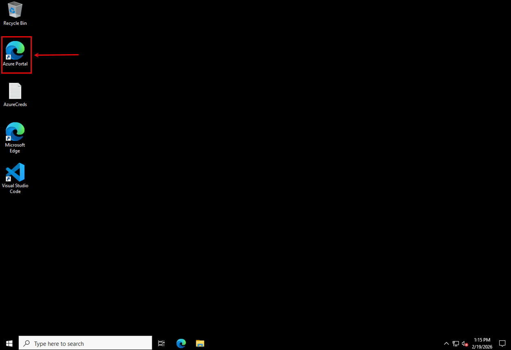

2. In the search bar at the top, type **OpenAI (1)** and select **Azure OpenAI (2)**.

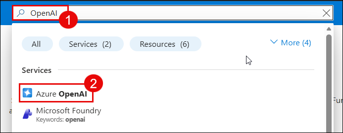

3. After the Azure OpenAI resource opens. From the top menu, click **Go to Foundry portal (1)**.

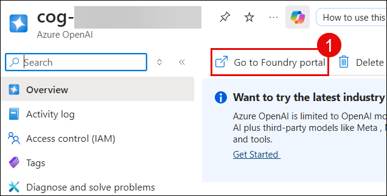

---

## Step 2: Deploy the GPT-4o Model

1. In the Foundry portal, navigate to **Model catalog (1)** from the left sidebar.

2. Search for **gpt-4o (2)** in the search box.

3. Select the **gpt-4o (3)** model and click **Use this model**.

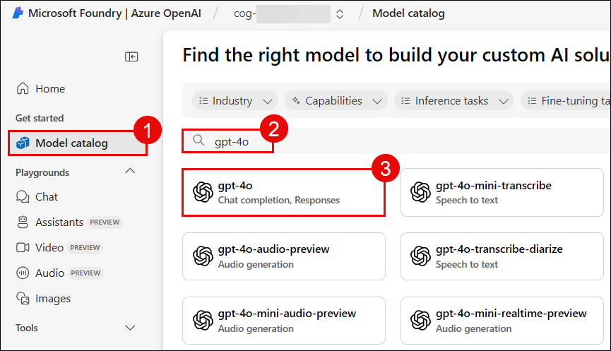

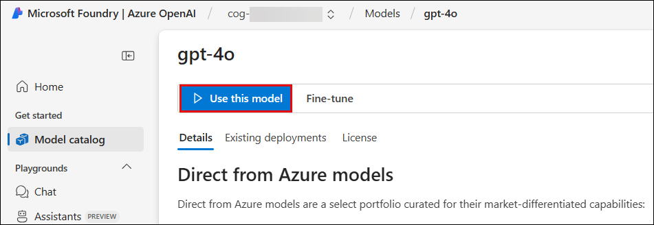

4. The deployment form opens. Click on **Customise** and configure the following settings:

   - **Deployment name (1):** `chat`
   - **Deployment type (2):** Select `Global Standard`
   - **Model version (3):** Select the Default Version.
   - **Tokens per Minute Rate Limit (4):** Keep at default (250K TPM) or adjust as needed
   - Review the deployment details and click **Deploy (5)**.

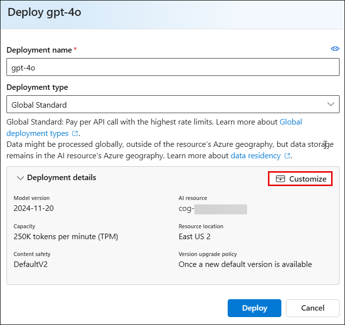

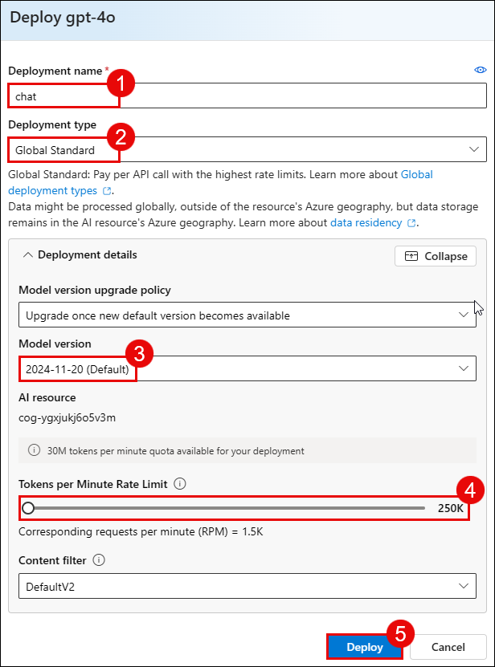

5. Wait for the model deployment to complete and proceed for the next step.

---

## Step 3: Deploy the text-embedding-ada-002 Model

1. In the Foundry portal, return to **Model catalog (1)**.

2. Search for **text-embedding-ada-002 (2)** in the search box.

3. Select the **text-embedding-ada-002 (3)** model and click **Use this model**.

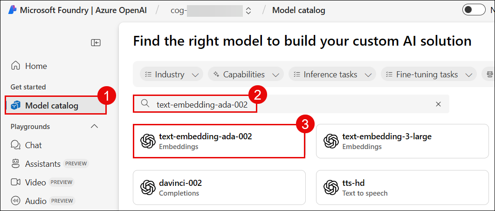

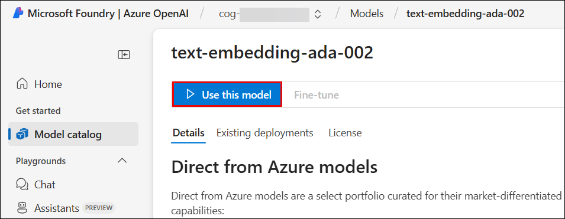

4. The deployment form opens. Click on **Customise** and configure the following settings:

   - **Deployment name (1):** `embedding`
   - **Deployment type (2):** Select `Global Standard`
   - **Model version (3):** Select the Default Version.
   - **Tokens per Minute Rate Limit (4):** Keep at default (250K TPM) or adjust as needed
   - Review the deployment details and click **Deploy (5)**.

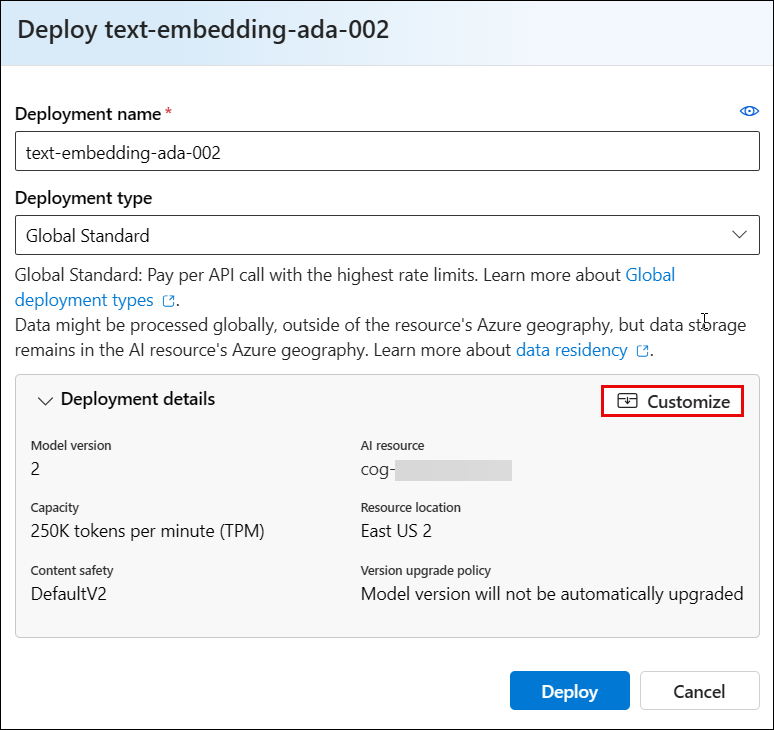

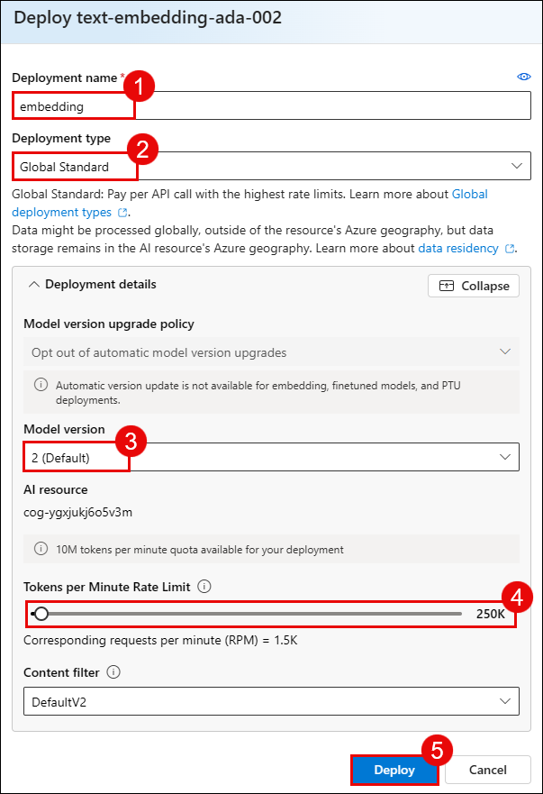

5. Wait for the deployment to complete.

---

## Step 4: Navigate to Azure Blob Storage

1. Return to the Azure Portal.

2. Search for **storage** in the search bar and select **Storage accounts (1)**.

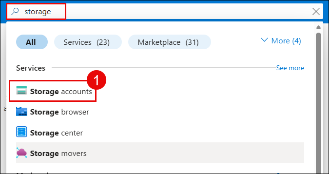

3. Click on the **storage account(1)** to open it.

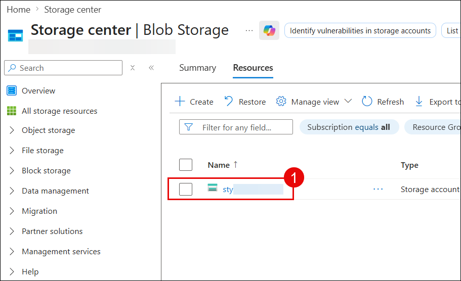

4. In the left sidebar, expand **Data storage (1)** and click **Containers(2)**.

5. You will see two containers: `slogs` and `content`. Click on the **content (3)** container.

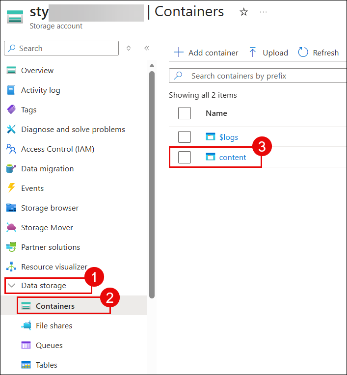

---

## Step 5: Upload Documents to Blob Storage

1. Inside the content container, click the **Upload (1)** button.

2. In the upload panel on the right, click **Browse for files (2)** to select your Contoso Real Estate sample documents.

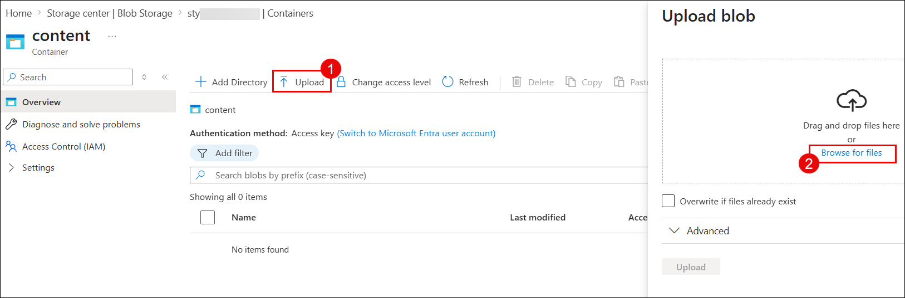

3. Navigate to the data folder  **`azure-labs\azure-search-openai-javascript\data`(1)** and select the **documents(2)** to upload (PDF or text files) and click **Open(3)**

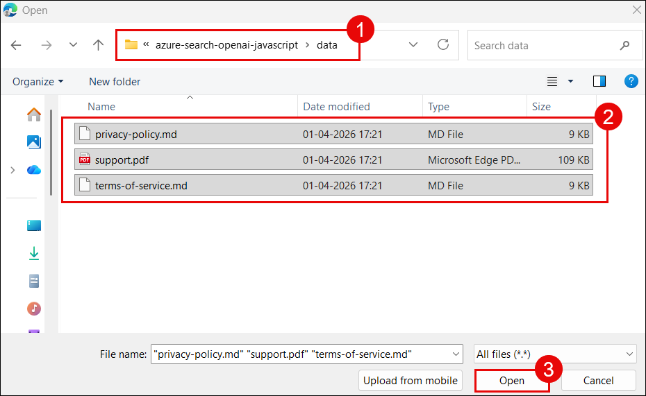

4. Click **Upload (1)** to add the documents to the knowledge base.

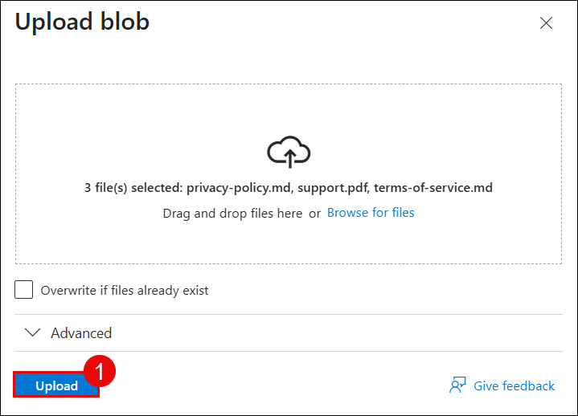

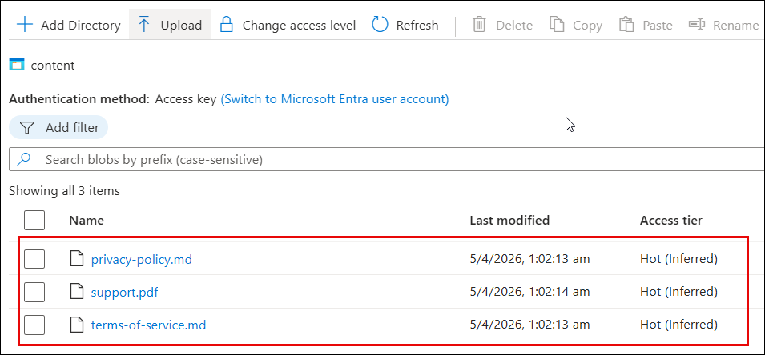

---

## Verification

After uploading your documents, verify both steps were successful:

- ✅ The **gpt-4o** model deployment is active in the Foundry portal.
- ✅ The **text-embedding-ada-002** model deployment is active in the Foundry portal.
- ✅ Your Contoso Real Estate documents are visible in the **content** container in Blob Storage.

---

## Next Step

Once the model deployments and document uploads are complete, proceed to the next lab module to configure Azure AI Search and the import pipeline.

---