# Lab 3: Configure Azure AI Search for RAG
### Overall Estimated Duration: 1 Hour
---
## Overview
In this lab, you will configure Azure AI Search to create a retrieval-augmented generation (RAG) pipeline. This service will index the documents from Azure Blob Storage, vectorize the content using the embedding model deployed in Lab 2, and enable semantic search capabilities. By the end of this lab, you will have a fully functional search index that can retrieve relevant documents for your AI applications.

---
## Objectives
By the end of this lab, you will be able to:
- Set up an Azure AI Search import pipeline from Blob Storage
- Configure vector embeddings using Azure OpenAI
- Enable semantic ranking for improved search relevance
- Create and run an indexer to populate the search index
- Validate document retrieval using the Search explorer.

---
## Step 1: Navigate to Azure AI Search Service
Start by locating and opening your Azure AI Search service in the Azure Portal.

1. In the Azure Portal search bar at the top, search for **"AI Search (1)"**
2. Select **AI Search service (2)** from the search results

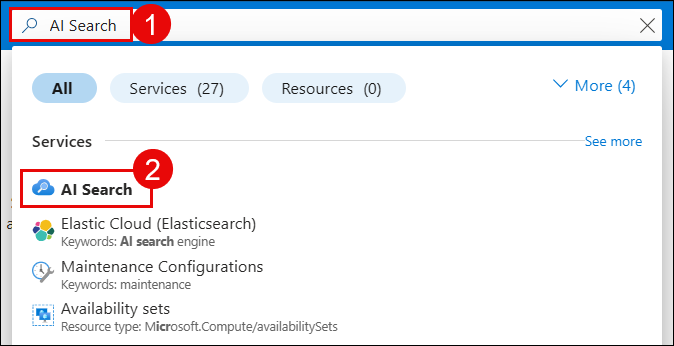

3. Once the service opens, locate and click the **"Import data"** button in the Overview tab.

This action will launch the guided import wizard to configure your data pipeline.

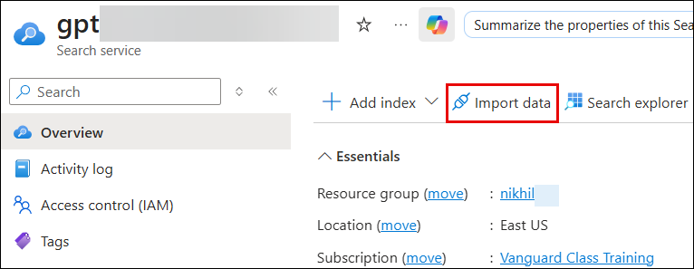

---
## Step 2: Configure Data Source Connection

1. On the "Choose a data source" screen, select **"Azure Blob Storage"**.

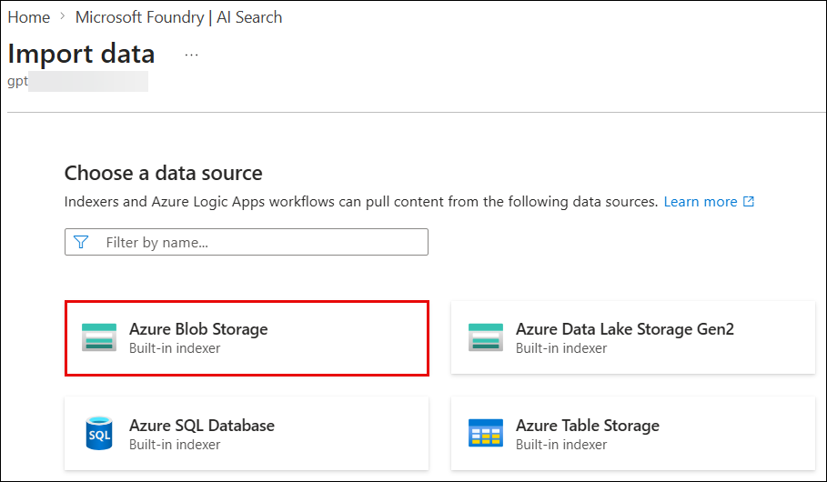

2. On the "What scenario are you targeting?" screen, select **"RAG"**.

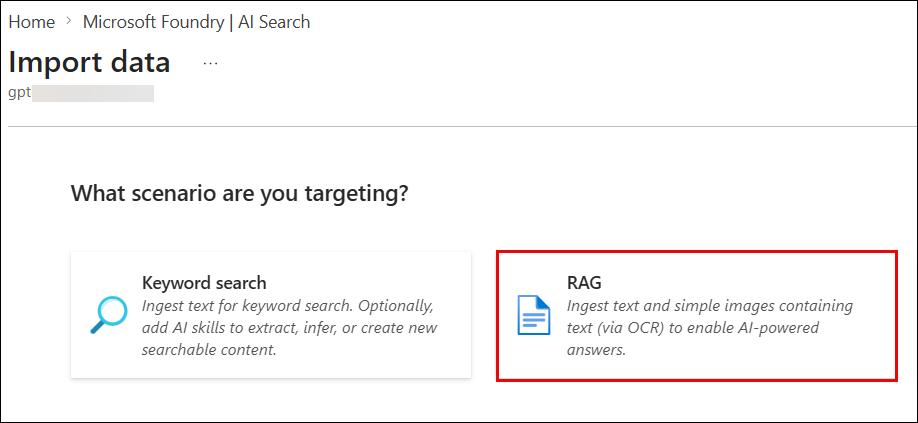

---
## Step 3: Connect to Azure Blob Storage
Configure the connection details to your storage account where the documents are located.

1. In the "Configure your Azure Blob Storage" section, fill in the following fields:
   - **Subscription (1)**: Select your Azure subscription
   - **Storage account (2)**: Select your storage account name
   - **Blob container (3)**: Select blob container name (ex : content)
   - Leave **Blob folder** empty (unless documents are in a subfolder)
   - **Parsing mode**: Keep as "Default"
   - Click **"Next (4)"** to proceed

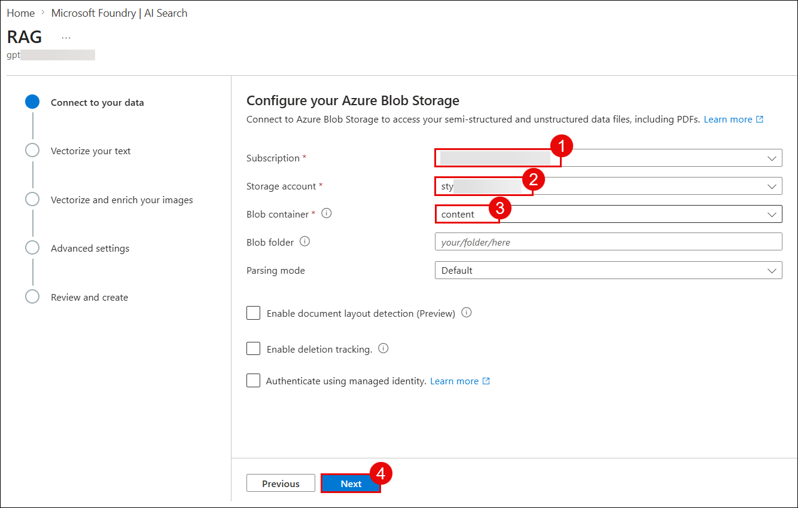

---
## Step 4: Set Up Vector Embeddings
Configure the Azure OpenAI embedding model to vectorize your document content for semantic search.

1. In the "Vectorize your text" section, configure:
   - **Kind (1)**: Select "Azure OpenAI"
   - **Subscription(2)**: Select your Azure subscription
   - **Azure OpenAI service (3)**: Select "cog" (your Azure OpenAI resource)
   - **Model deployment (4)**: Select "embedding" (the text-embedding-ada-002 model deployed in Lab 2)
   - **Authentication type (5)**: Keep "API key" selected (default)
   - Check the **acknowledgment box (6)** confirming additional costs for Azure OpenAI service usage
   - Click **"Next" (7)** to continue

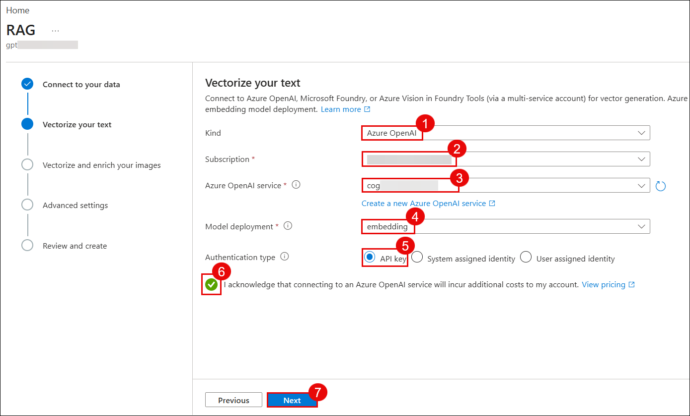

---
## Step 5: Configure AI Skills and Advanced Settings
Set up optional enrichment and advanced search capabilities.

1. On the "Vectorize and enrich your images" screen:
   - Uncheck "Vectorize images" (for this lab, we'll focus on text)
   - Uncheck "Extract text from images" (not required for this scenario)

2. Click **"Next"** to proceed

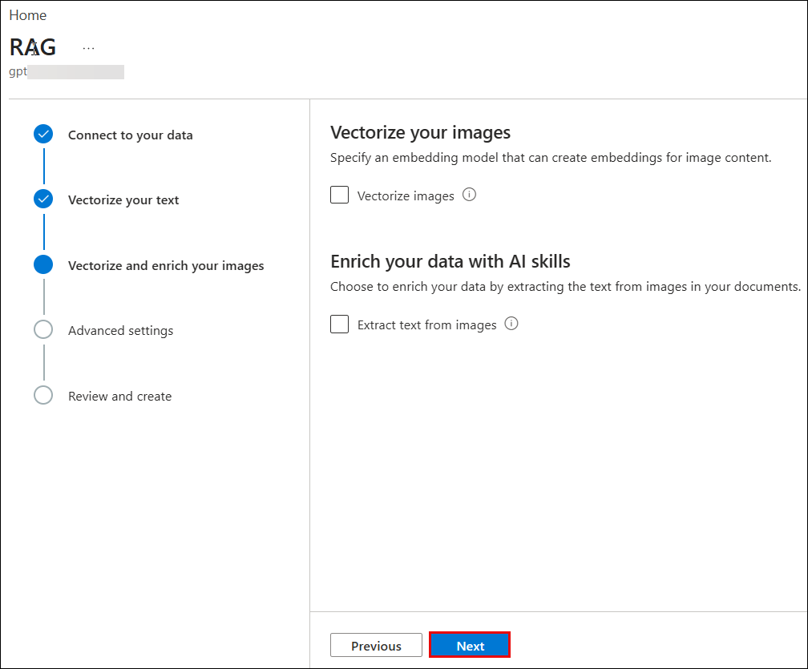

On the "Advanced settings" screen:

1. Enable **"Enable semantic ranker" (1)** to improve search relevance using semantic understanding
2. Keep other settings at default values
3. Click **"Next" (2)** to proceed

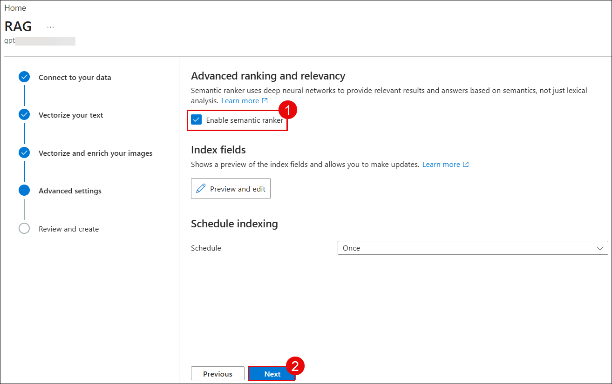

---
## Step 6: Review Configuration and Create Index
Review your complete configuration before creating the search resources.

1. On the "Review your configuration" screen, you'll see:
   - **Objects name prefix (1)**: "gptkbindex"
   - **Vectorize your text**: Azure OpenAI service with "embedding" model
   - **Semantic ranker**: Enabled
   - **Indexer run schedule**: Once (on-demand)

2. Click **"Create" (2)** to deploy the search infrastructure

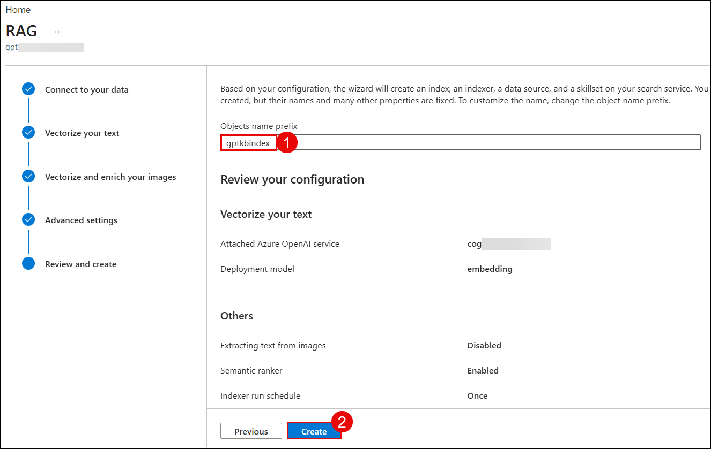

The wizard will now create:
- **Index**: The search index structure
- **Data source**: Connection to Blob Storage
- **Skillset**: Processing pipeline with embeddings
- **Indexer**: Orchestrator that pulls and processes documents

Wait for the success message displayed below and click **Close**

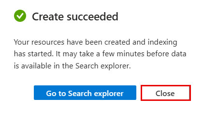

---
## Step 7: Monitor Data Source
Verify that the data source and indexer have been created successfully.

1. In the left sidebar, expand **"Search management" (1)** → **"Data sources" (2)**
2. You should see the data source listed, connected to your Azure Blob Storage **Click (3)** on it.

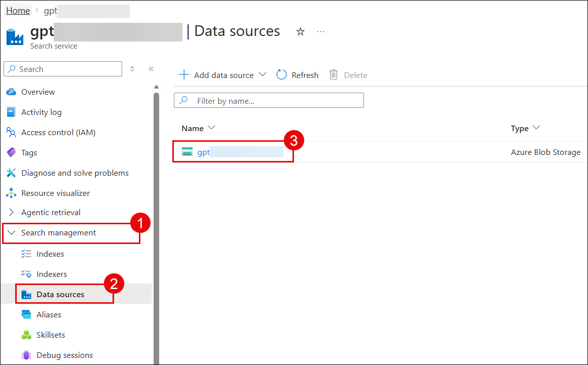

You can explore the Data Source configurations here.

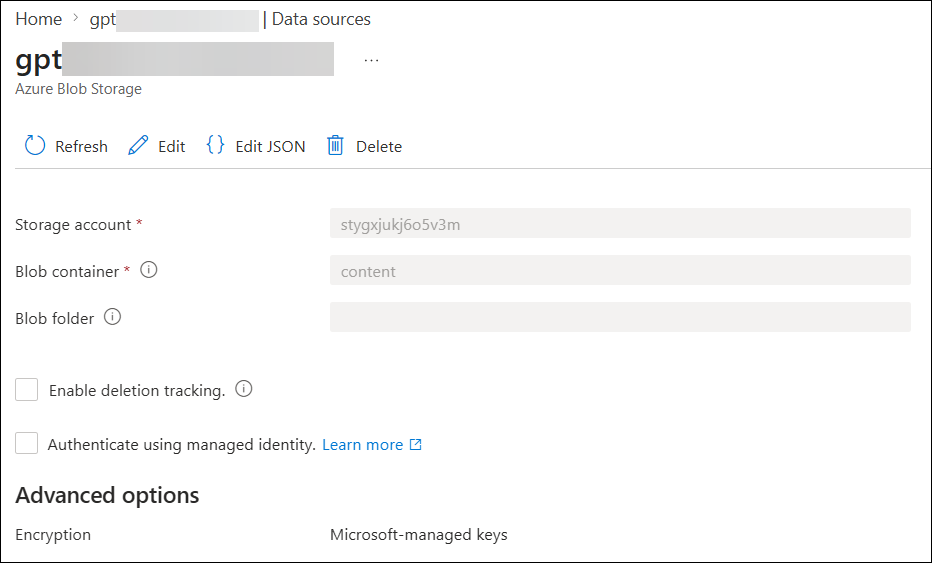

---
## Step 8: Check Indexer Status
Verify that the indexer has been created and is ready to run.

1. In the left sidebar, navigate **"Indexers" (1)**
2. You should a "Success" status indicator and click on the **Indexer (2)**

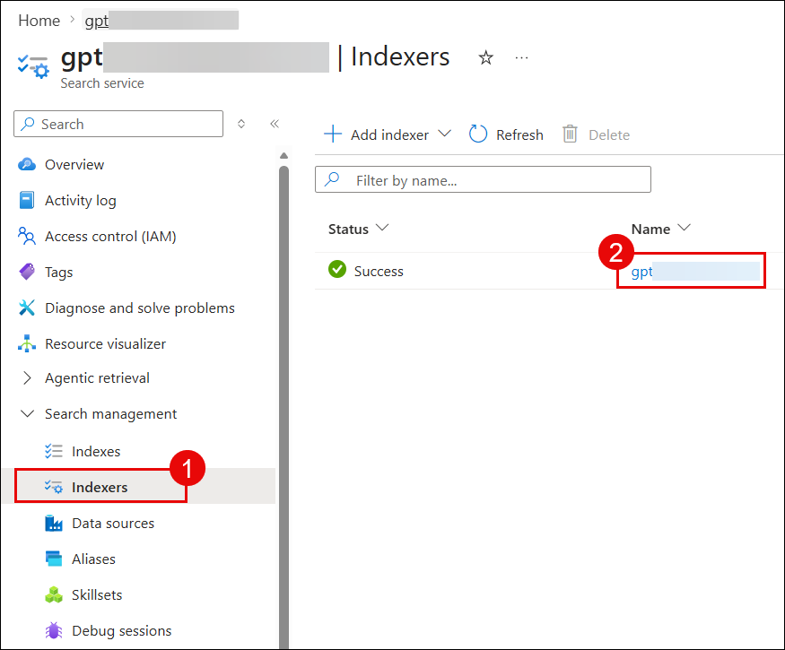

Execute the indexer to process and index all documents from Blob Storage.

3. Click the **"Run" (3)** button to start indexing your documents

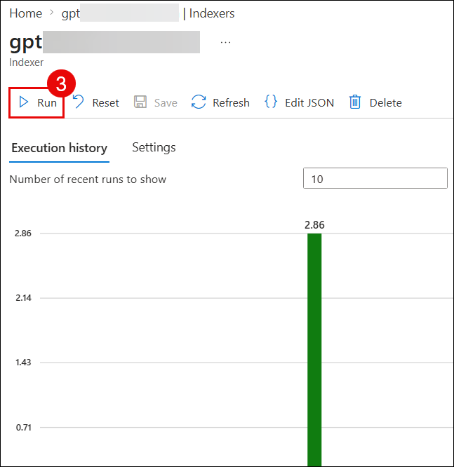

A confirmation dialog will appear:

4. Click **"Yes" (4)** to confirm running the indexer

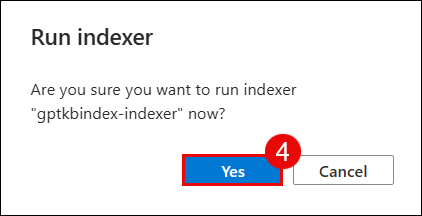

The indexer will now crawl your Blob Storage, process each document, generate vector embeddings using the Azure OpenAI embedding model, and populate the search index.

---
## Step 9: Validate Index and Search
Verify that documents have been successfully indexed and are searchable.

1. In the left sidebar, navigate to **"Indexes" (1)**
2. Click on the **index name (2)** to view its details

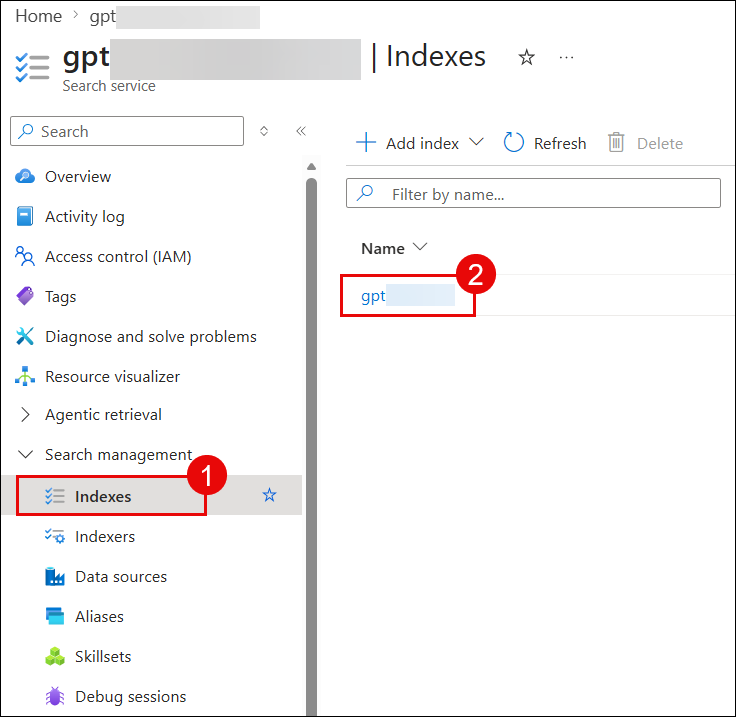

3. The index overview shows:
   - Navigate to **Search explorer (3)**

4. Click **"Search" (4)** to retrieve results

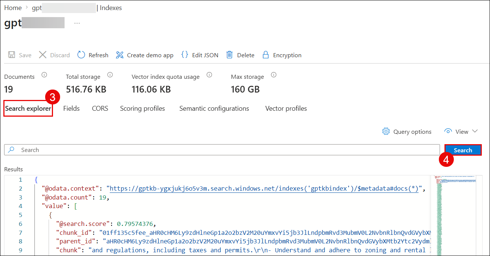

The search results display:
- Relevant documents matched by the query
- Semantic scoring and ranking
- Complete document metadata and content chunks
- Vector embeddings used for retrieval

---

For additional information go through the [Azure AI Search documentation](https://learn.microsoft.com/azure/search/)

In the **next lab** you will deploy and test the web application that integrates your Azure OpenAI chat model with the search index you just created, enabling users to ask questions about the Contoso Real Estate documents and receive AI-powered responses with relevant document references.