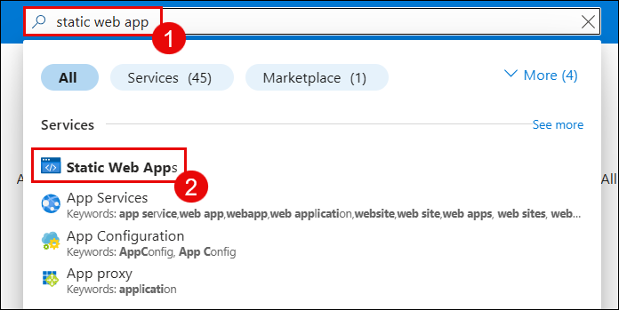
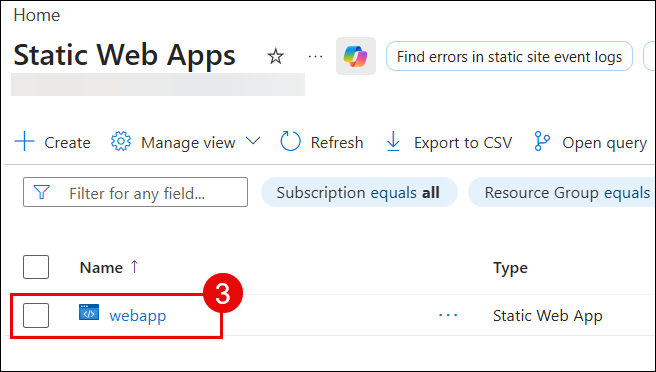
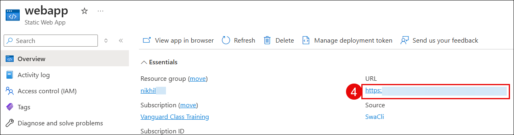
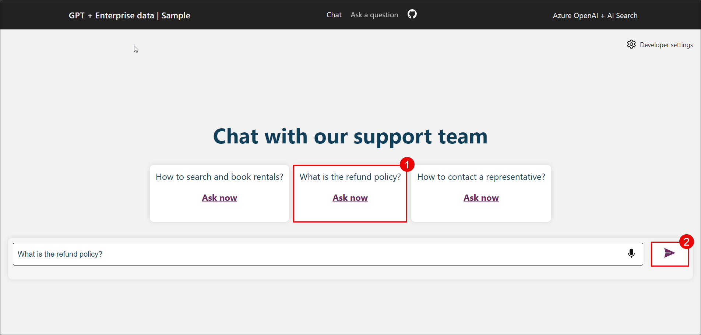
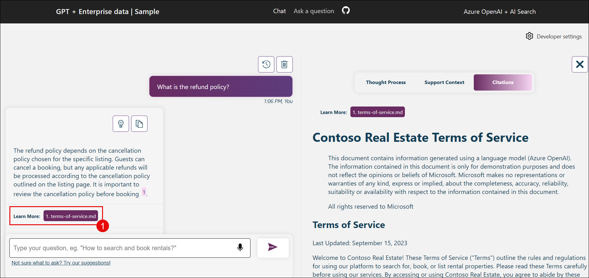

# Lab 4: Access and Test the Deployed RAG Web Application
### Overall Estimated Duration: 20 Minutes
---
## Overview
In this final lab, you will access the deployed RAG web application hosted on Azure Static Web Apps. This application integrates your Azure OpenAI GPT-4o chat model with the Azure AI Search index created in Lab 3. You will test the chat interface by asking questions about the Contoso Real Estate documents and verify that the RAG system returns accurate answers with relevant document citations and support context.

---
## Objectives
By the end of this lab, you will be able to:
- Locate the deployed Static Web App in the Azure Portal
- Access the RAG web application through its public URL
- Test the chat interface with natural language queries
- Understand how the RAG system retrieves relevant documents
- View AI responses with citations and supporting context
- Verify the end-to-end RAG workflow is operational

---
## Step 1: Search for Static Web Apps in Azure Portal
Start by finding the deployed Static Web App resource in the Azure Portal.

1. Open the **Azure Portal** in your web browser
2. In the search bar at the top, type **"Static Web Apps (1)"**
3. Select **"Static Web Apps" (2)** from the search results



The Static Web Apps service shows all web applications deployed in your subscription.

4. Click on the **"webapp" (1)** entry to view its details and configuration



Retrieve and open the application's public URL to access the RAG chat interface.

5. In the web app details page, look for the **URL** field in the Essentials section Copy the URL or click on the **URL (4)** to open the application in a new browser tab



This URL is the public endpoint for your deployed RAG application where users can access the chat interface.

---
## Step 2: Explore the Chat Interface
Familiarize yourself with the web application's user interface.

1. The web application displays the main chat interface with the title **"Chat with our support team"**
2. At the top, you'll see the application name: **"GPT + Enterprise data | Sample"**
3. The interface shows **suggested questions** about the knowledge base, such as:
   - "How to search and book rentals?"
   - "What is the refund policy?" (highlighted)
   - "How to contact a representative?"
4. Click on one of the suggested questions, such as **"What is the refund policy?" (1)** and click **send button (2)**.



The question is sent to the RAG system for processing.

5. The response also includes a **"Learn More(1)"** link to source documents.



Examine the AI-generated response and the document citations provided.

This demonstrates the complete RAG workflow: query retrieval, document search, and AI-augmented response generation.

---
## Step 3: Prompting Sessions with Enterprise Data
Now that you have explored the chat interface, try asking questions related to the Contoso Real Estate documents that were indexed in the Azure AI Search service. These documents include terms of service, privacy policy, customer support guide, and other enterprise data from the repository dataset.

Here are some sample prompts you can try in the chat interface:

1. **Refund Policy Questions:**
   ```
   What is the refund policy for Contoso Real Estate?
   ```
   ```
   Can I get a refund if I cancel my booking within 24 hours?
   ```

2. **Booking and Search Questions:**
   ```
   How do I search and book rental properties?
   ```
   ```
   What information do I need to provide when booking a property?
   ```

3. **Privacy and Terms Questions:**
   ```
   What is covered in the privacy policy?
   ```
   ```
   What are the terms of service for using Contoso Real Estate services?
   ```

4. **Support and Contact Questions:**
   ```
   How can I contact customer support?
   ```
   ```
   What should I do if I have issues with my booking?
   ```

5. **Property Information Questions:**
   ```
   What types of properties are available for rent?
   ```
   ```
   Are there any restrictions on property usage?
   ```

For each prompt you try:
- Observe how the RAG system retrieves relevant information from the indexed documents
- Check the citations provided in the response
- Review the supporting context in the tabs
- Note how follow-up questions build on previous conversations

---
## Understanding the RAG Workflow
The application you just tested demonstrates the complete Retrieval-Augmented Generation process:

**Step 1: Query Processing**
- Your question is submitted to the application
- The query is analyzed to understand intent and context

**Step 2: Document Retrieval**
- Azure AI Search searches the index for relevant documents
- The embedding model vectorizes your query for semantic matching
- Top matching documents are retrieved (e.g., terms-of-service.md)

**Step 3: Context Augmentation**
- Retrieved document excerpts are prepared as context
- The context is combined with your question

**Step 4: Generation**
- Azure OpenAI GPT-4o generates a response using:
  - The original question
  - Retrieved document context
  - System instructions for citation

**Step 5: Response Enhancement**
- The response includes citations to source documents
- Supporting context is organized in tabs
- Related follow-up questions are suggested

## Congratulations!
You have successfully completed the Azure OpenAI and Azure AI Search workshop! You now have a fully functional RAG application that can:

- Answer questions about uploaded documents using natural language
- Provide accurate responses with source citations
- Scale to handle large document collections
- Integrate with various Azure AI services

This implementation demonstrates the power of combining generative AI with semantic search for enterprise knowledge management and intelligent document processing.